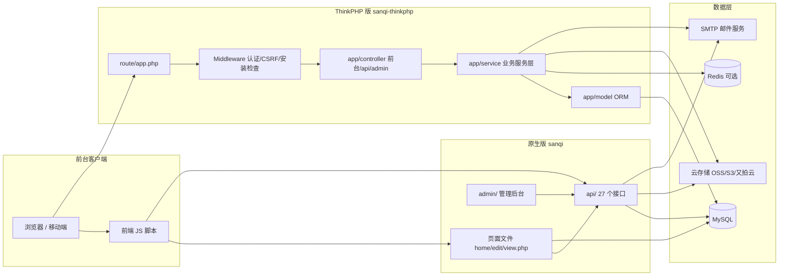
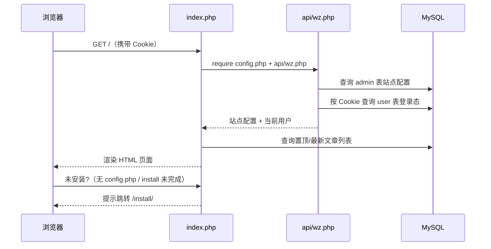
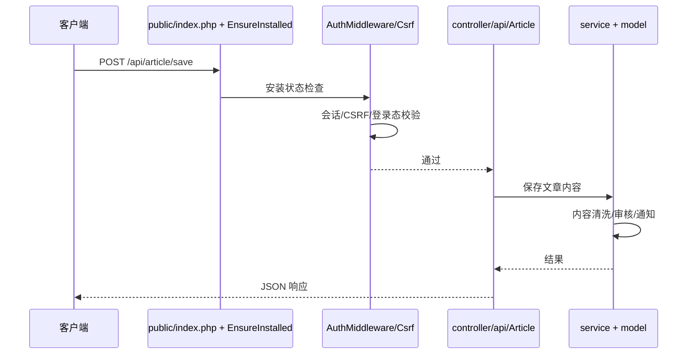

# sanqi 系统架构

## 概述

sanqi 是一个用 PHP 编写的单用户「朋友圈」风格社交分享系统。站长部署后拥有一个类似朋友圈的个人主页：访客可以浏览文章与个人档案、注册账号、发表文字/图文/视频/音乐/长文章、进行评论与留言、点赞互动、接收消息邮件通知，管理员则在后台统一管理内容、用户、友链、审核、邮件、云存储与系统安全。

系统在仓库中提供两个可独立部署的实现：`sanqi/` 是无框架的 PHP 原生版，零编译、零 Composer 依赖，上传即用，适合快速上线与轻量环境（代码规模约 70 个页面/接口文件）；`sanqi-thinkphp/` 是基于 ThinkPHP 8 的现代 MVC 重构版（代码规模约 600 个 PHP 文件），在原有功能上补齐了 Markdown 文章、草稿自动保存、投票、表情管理、通知中心、配置版本回滚、数据库备份迁移、2FA 二次验证、云存储（OSS/S3/又拍云）、多源音乐代理等企业级能力。

两个版本共享同一套核心数据模型（用户、文章、评论、点赞、留言、友链、配置），业务可互相迁移；ThinkPHP 版是原生版功能的超集。

## 技术栈

**语言与运行时**
- PHP 7.x（原生版，`mysqli` 扩展）
- PHP 8.0+（ThinkPHP 版）
- JavaScript / jQuery（两个版本前端共用同一套交互脚本）

**框架**
- 原生版：无框架，页面直接输出 HTML，API 返回 JSON
- ThinkPHP 版：topthink/framework ^8.0、think-orm ^3/^4、think-view、think-filesystem

**数据存储**
- MySQL（InnoDB，utf8mb4）；数据库配置由环境变量/`.env` 提供（ThinkPHP 版）或安装时生成 `config.php`（原生版）
- Redis（可选，`RedisService` 提供缓存与限流支撑）

**通知与上传**
- PHPMailer（原生版内置 `site/email/PHPMailer/`；ThinkPHP 版使用 `phpmailer/phpmailer`）
- 云存储：又拍云（原生版 `api/upyun.php`）、OSS / S3（ThinkPHP 版 `CloudStorageService`），本地文件回退

**基础设施**
- 部署形态：任意支持 PHP 的 Web 服务器（Apache/Nginx），ThinkPHP 版将 `public/` 设为站点根目录
- 无需构建工具链；原生版上传即用

## 项目结构

```
project-root/
├── sanqi/                 # PHP 原生版（无框架，上传即用）
│   ├── index.php          # 首页入口（站点信息 + 首页流）
│   ├── home.php           # 用户主页
│   ├── view.php           # 文章详情页
│   ├── edit.php           # 编辑器（发布文章）
│   ├── setup.php          # 个人资料设置
│   ├── repass.php         # 修改/重置密码页
│   ├── archives.php       # 文章归档
│   ├── api/               # 全部前端接口（JSON，约 27 个文件）
│   ├── admin/             # 管理后台页面（页面 + api/ 子目录）
│   ├── install/           # 可视化安装向导（建表 + 生成 config.php）
│   ├── site/              # 站点侧组件：邮件(mailtemplate/email)、播放器、页面加密、音乐库
│   ├── user/              # 用户数据目录（头像/上传文件）
│   └── assets/            # 静态资源（css/js/img/owo 表情/mesg 弹窗）
│
├── sanqi-thinkphp/        # ThinkPHP 8 增强版
│   ├── public/            # Web 入口（index.php），含前端编译后资源
│   ├── app/
│   │   ├── controller/    # 控制器：前台 9 个、后台 admin/ 21 个、api/ 12 个、server/ 2 个
│   │   ├── service/       # 业务服务层（22 个服务）
│   │   ├── model/         # ORM 模型（16 个，对应数据库表）
│   │   ├── middleware/    # 7 个中间件（认证/CSRF/安装检查/日志）
│   │   ├── helper/        # 全局辅助函数（auth/security/markdown/emoji...）
│   │   ├── validate/      # 表单验证器（4 个）
│   │   ├── traits/        # 通用特征（Auth/SiteConfig/ArticleHelper）
│   │   ├── command/       # 命令行任务（5 个）
│   │   └── view/          # 模板视图
│   ├── route/app.php      # 全部路由定义（前台/API/后台/server）
│   ├── config/            # 框架配置（15 个文件）
│   ├── database/          # install.sql + 13 个迁移脚本
│   ├── extend/            # 第三方扩展（psr-0 自动加载）
│   ├── runtime/           # 运行缓存/日志
│   └── vendor/            # Composer 依赖
│
└── .monkeycode/docs/      # 本文档
```

**入口点**
- `sanqi/index.php` - 原生版首页与应用状态入口
- `sanqi/install/install.php` - 原生版安装向导（建表）
- `sanqi-thinkphp/public/index.php` - ThinkPHP 版统一入口
- `sanqi-thinkphp/route/app.php` - ThinkPHP 版路由定义
- `sanqi-thinkphp/app/controller/` - 业务控制器入口

## 子系统

### 1. 前台页面 (`sanqi/` 根目录 / `sanqi-thinkphp/app/controller/{Index,Home,View,Edit,Setup,Repass,Sticky}.php`)
**目的**: 渲染首页流、用户主页、文章详情、编辑器、个人设置等页面。
**位置**: `sanqi/index.php`、`home.php`、`view.php`、`edit.php`、`setup.php`、`repass.php`、`archives.php`
**关键文件**: `sanqi/api/wz.php`（站点配置与登录态加载）、`sanqi-thinkphp/app/controller/View.php`
**依赖**: 配置子系统、用户子系统、文章子系统
**被依赖**: 前端 JS（`assets/js/home.js`、`view.js`、`edit.js` 等）

原生版的每个前台页面在开头加载 `config.php` + `api/wz.php`：`wz.php` 读取 Cookie 会话（`username`+`passid`）、连接数据库、加载 `admin` 表站点配置，并检查安装状态（`iteace`）与站点开关，之后页面主体直接用 SQL 查询渲染。ThinkPHP 版改为控制器 + 模板的 MVC 结构，统一由 `EnsureInstalled`/`AuthMiddleware` 中间件处理安装校验与会话。

### 2. 前端接口 API (`sanqi/api/` / `app/controller/api/*`)
**目的**: 原生版约 27 个 JSON 接口覆盖登录注册、文章增删改、评论、点赞、留言、邮件、上传、云存储、音乐、页面密码等；ThinkPHP 版收敛为 `api/` 命名空间下 12 个控制器并增加轮询、草稿、附件下载、抖音解析等。
**位置**: `sanqi/api/*.php`（27 文件）；`sanqi-thinkphp/app/controller/api/`（12 控制器）
**关键文件**: `sanqi/api/form.php`（发布文章）、`sanqi/api/homeapi.php`（首页流加载）、`sanqi/api/login.php`、`sanqi/api/sendmail.php`
**依赖**: 文章、用户、评论、配置等所有数据子系统；上传与云存储服务
**被依赖**: 前台页面 JS、后台管理页面

原生版接口输入统一做 `addslashes(htmlspecialchars())` 过滤，仅允许 POST 且带登录态；ThinkPHP 版除控制器逻辑外再叠加 `AuthMiddleware`、`CommentSecurityService`、`safeFilter()`/`cleanXss()` 等安全层。

### 3. 管理后台 (`sanqi/admin/` / `app/controller/admin/*`)
**目的**: 站点信息、基础设置、权限开关、用户管理、文章/评论审核、邮件 SMTP 设置与测试、图床/云存储设置、友链管理、注册开关、版本检查、数据桶备份等。
**位置**: `sanqi/admin/*.php`（11 页面）+ `sanqi/admin/api/*`（6 接口）；`sanqi-thinkphp/app/controller/admin/`（21 控制器）
**关键文件**: `sanqi/admin/basic.php`、`sanqi-thinkphp/app/controller/admin/Basic.php`
**依赖**: 配置子系统、用户子系统、邮件（SMTP）、云存储
**被依赖**: 仅管理员

后台页面同样通过 `wz.php` 校验管理员身份（账号角色/令牌），无权限则重定向；ThinkPHP 版由 `AdminAuth` 中间件统一保护 `/admin` 路由组并写操作日志（`AdminLogService`）。

### 4. 配置子系统 (`admin` 表 / `configx` 表)
**目的**: 站点的全部可配置项（站点名、副标题、图标、开关、权限、邮件、音乐、审核、云存储等）。
**位置**: 原生版 `admin` 表（字段即配置项，如 `name/subtitle/icon/zt/regqx/kqsy/ptpaud`）；ThinkPHP 版 `configx` 表（`title+text(JSON)` 键值对）
**关键文件**: `sanqi-thinkphp/app/model/Configx.php`、`app/service/SiteConfigService.php`
**依赖**: 数据库
**被依赖**: 所有前台页面、API、后台

ThinkPHP 版新增 `SiteConfigService` 统一读取/缓存配置，并提供配置版本快照回滚（`ConfigVersions` 控制器 + `ConfigVersionService`）。

### 5. 安全与认证 (`app/middleware/` + `service/AuthService` 等)
**目的**: 会话、CSRF、安装状态、限流、敏感操作保护。
**位置**: `sanqi-thinkphp/app/middleware/*`（AuthMiddleware、AdminAuth、CsrfVerify、CheckInstalled、EnsureInstalled、ExceptionLog、ServerAdminAuth）；`sanqi-thinkphp/app/service/AuthService.php`
**关键文件**: `AuthMiddleware.php`、`CsrfVerify.php`、`RateLimitService.php`
**依赖**: 用户子系统、缓存/Redis
**被依赖**: 前台页面、API、后台入口

原生版无中间件概念，安全依赖各文件开头的重复校验（方法请求限制、登录态、封禁检查、秘钥校验 `$allkey`）；ThinkPHP 版将这些横切关注点全部中间件化。

### 6. 邮件通知 (`site/email/` / `app/service/EmailService.php`)
**目的**: 注册验证、评论/点赞/回复通知、密码重置等邮件的发送。ThinkPHP 版 `EmailTemplateService` 提供统一 HTML 外壳装饰。
**位置**: `sanqi/site/email/email.php`、`sanqi/site/mailtemplate.php`；`sanqi-thinkphp/app/service/EmailService.php`、`EmailTemplateService.php`
**关键文件**: `sanqi/site/email/PHPMailer/`（原生版内置 PHPMailer 老版收发）
**依赖**: SMTP 配置、`admin`/`configx` 中邮件字段
**被依赖**: `api/sendmail.php`、`api/emaitzzt.php`、注册/评论/点赞/回复流程、后台邮件测试

## 图表



**首页请求时序（原生版）**：



**ThinkPHP 版请求时序**：



## 数据模型关系

```mermaid
erDiagram
    USER ||--o{ ESSAY : "发布"
    USER ||--o{ COMM : "发表评论"
    ESSAY ||--o{ COMM : "被评论"
    ESSAY ||--o{ LCKE : "被点赞"
    USER ||--o{ LCKE : "点赞"
    ESSAY ||--o{ ARTICLE_ATTACHMENTS : "携带附件"
    ESSAY ||--o{ ARTICLE_DRAFT_VERSIONS : "草稿版本"
    ESSAY ||--o{ POLL_VOTES : "包含投票"
    POLLS ||--o{ POLL_VOTES : "选项被投"
    USER ||--o{ MESSAGE : "接收通知"
    LINK : "友链"
    EMOJI : "表情"
    FILE_UPLOADS : "文件"
    COMMENT_EDIT_HISTORY : "评论编辑记录"
```

> 注：`article_attachments`/`article_draft_versions`/`comment_edit_history`/`file_uploads`/`polls`/`poll_votes`/`emoji` 为 ThinkPHP 版新增表，原生版仅使用 `user`/`essay`/`comm`/`lcke`/`message`/`link`/`admin`/`configx` 八张表。