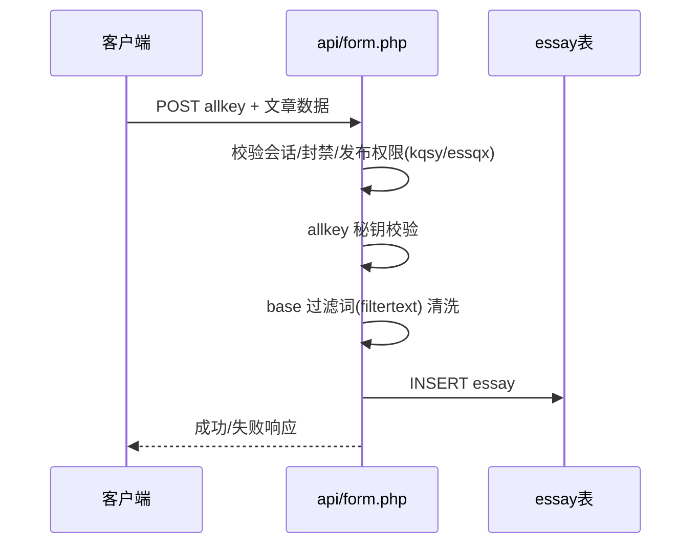

# 文章（essay）

文章是 sanqi 内容流的主体，由用户发布，支持多种内容类型与审核/可见性状态。

## 什么是文章？

文章对应 `essay` 表，一条记录即一条「朋友圈」。支持类型（`ptplx`）：

| 类型值 | 含义 |
|--------|------|
| `img` | 图文 |
| `video` | 视频 |
| `music` | 音乐 |
| `article` | 长文章（含标题/封面） |
| `only` | 仅文字 |

文章内容（文字、图片、视频、音乐、定位）写入独立字段；可见性（`ptpys`）与审核状态（`ptpaud`）由作者与后台共同控制。

## 代码位置

| 方面 | 位置 |
|------|------|
| 模型 | `sanqi-thinkphp/app/model/Essay.php` |
| 控制器 | `sanqi-thinkphp/app/controller/api/Article.php`、`app/controller/View.php`、`Edit.php` |
| 原生接口 | `sanqi/api/form.php`（发布）、`api.php`（流）、`homeapi.php`（主页流）、`delewz.php`（删除）、`topes.php`（置顶） |
| 数据库 | `essay` 表 |

## 关键字段

| 字段 | 类型 | 描述 |
|------|------|------|
| `id` | int unsigned | 自增主键 |
| `cid` | varchar(64) | 文章唯一标识（对外引用） |
| `ptpuser` | varchar(64) | 发布者账号 |
| `is_anonymous` | tinyint(1) | 是否匿名发布（ThinkPHP 版） |
| `ptptext` | text | 正文 |
| `ptpimag` / `ptpvideo` / `ptpmusic` | text | 图片/视频/音乐列表 |
| `ptplx` | varchar(20) | 内容类型 |
| `ptpdw` | varchar(255) | 定位 |
| `tags` | varchar(500) | 标签/话题 |
| `ptptime` | datetime | 发布时间 |
| `ptpgg` / `ptpggurl` | tinyint + varchar | 是否广告及跳转 URL |
| `ptpys` | tinyint(1) | 是否可见 |
| `commauth` | tinyint(1) | 是否允许评论 |
| `ptpaud` | tinyint | 审核状态（0 未审核 / >0 已审核） |
| `ip` | varchar(45) | 发布 IP |
| `article_title` / `article_cover` / `cover_color` | - | 长文章标题/封面/色调 |
| `article_template` | varchar(50) | 文章模板（ThinkPHP 版） |
| `user_top` | tinyint(1) | 用户置顶（ThinkPHP 版） |
| `delete_time` | datetime | 软删除时间（ThinkPHP 版） |

## 发布流程

## 不变量

1. **审核过滤**: 首页/主页流查询固定排除 `ptpaud=0`（未审核）与 `ptpys=0`（隐藏），详见 `sanqi/api/api.php` / `homeapi.php` 查询条件。
2. **软删除**: ThinkPHP 版使用 `delete_time` 软删除，原生版直接删除记录。
3. **有权限才可发**: 站点开关 `kqsy=1` 时仅管理员可发（`essqx=2`），`kqsy=0` 时按用户 `essqx` 判断（`sanqi/api/form.php`）。

## 附属数据

- 附件：`article_attachments` 表（ThinkPHP 版）
- 草稿版本：`article_draft_versions` 表（ThinkPHP 版自动保存）
- 评论：`comm` 表（见 [评论](./评论.md)）
- 点赞：`lcke` 表（见 [点赞](./点赞.md)）