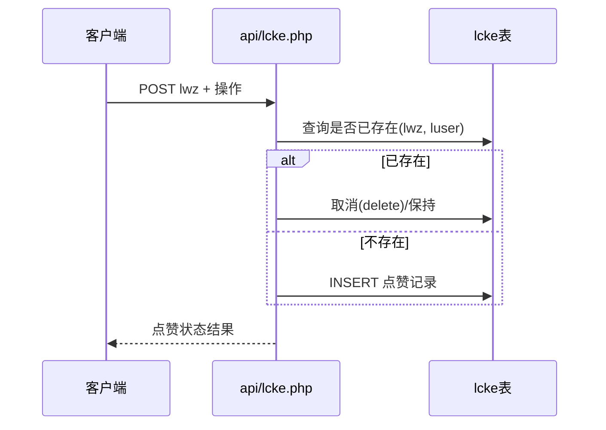

# 点赞（lcke）

点赞是用户对文章的轻量互动，记录在独立的点赞表中，表级唯一约束避免重复。

## 什么是点赞？

点赞对应 `lcke` 表（原生版表名）。一条记录表示「某个用户点赞了某篇文章」。系统通过 `(lwz, luser)` 唯一索引防止同一用户重复点赞；前端 `api/lcke.php` 负责点赞/取消切换。

**关键特征**:
- `lwz`（文章）+ `luser`（账号）二元组唯一
- 含冗余的用户资料快照（昵称 `lname`、头像 `limg`），便于列表直接展示而无需关联查询
- 点赞者对文章所有者的消息通知联动（`esseam` 邮箱通知）

## 代码位置

| 方面 | 位置 |
|------|------|
| 模型 | `sanqi-thinkphp/app/model/Lcke.php` |
| 控制器 | `sanqi-thinkphp/app/controller/api/Like.php` |
| 原生接口 | `sanqi/api/lcke.php` |
| 数据库 | `lcke` 表 |

## 关键字段

| 字段 | 类型 | 描述 |
|------|------|------|
| `id` | int unsigned | 自增主键 |
| `luser` | varchar(64) | 点赞者账号 |
| `lname` | varchar(100) | 点赞者昵称快照 |
| `limg` | varchar(500) | 点赞者头像快照 |
| `lwz` | varchar(64) | 被点赞文章 |
| `ltime` | datetime | 点赞时间 |

## 点赞流程

## 不变量

1. **唯一性**: `idx_lcke_lwz_luser` 唯一索引，同一用户对同一文章最多一条点赞。
2. **幂等切换**: 点过一次再次点击为取消，由接口根据是否已存在决定写入或删除。

## 互动联动

点赞会触发目标文章作者的消息通知；若作者开启邮件通知（`user.esseam=1`）则同时发送邮件（ThinkPHP 版通过 `api/user/email-notify`、`NotificationService`）。留言通知写入 `message` 表，见「留言板」相关接口 `api/messg.php`。