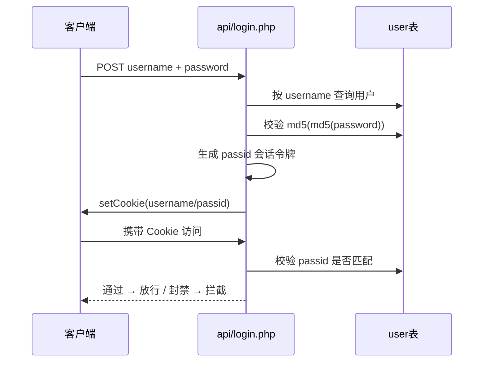

# 用户与认证

用户是 sanqi 站点的访问主体，具有账号、昵称、资料、权限与封禁状态；认证通过账号密码 + 会话令牌完成。

## 什么是用户？

用户对应 `user` 表，是文章、评论、点赞、留言等行为的归属实体（示例字段见下表）。系统有两类角色：`user`（普通用户）与 `admin`（管理员，native 版为 `admin` 表单独存储管理员）。

**关键特征**:
- 每个用户有唯一账号（`username`，UNIQUE）与邮箱（`email`，UNIQUE）
- 密码以 `md5(md5(password))` 双哈希存储（见 `sanqi/api/login.php` 校验），原生版同时生成会话令牌 `passid`
- 拥有发布权限位 `essqx`、封禁标记 `ban` 与解封时间 `bantime`

## 代码位置

| 方面 | 位置 |
|------|------|
| 模型 | `sanqi-thinkphp/app/model/User.php`（原生版无独立模型，直接用 SQL） |
| 服务 | `sanqi-thinkphp/app/service/AuthService.php` |
| API 路由 | `sanqi/api/login.php`、`reg.php`、`repass.php`、`updata.php`、`emaitzzt.php` |
| 页面 | `sanqi/setup.php`、`sanqi/repass.php`、`sanqi-thinkphp/app/controller/Setup.php` |
| 数据库 | `user` 表 |

## 关键字段

| 字段 | 类型 | 描述 |
|------|------|------|
| `id` | int unsigned | 主键，自增 |
| `username` | varchar(64) | 账号，UNIQUE |
| `password` | varchar(255) | 密码（md5 双哈希） |
| `email` | varchar(255) | 邮箱，UNIQUE |
| `name` | varchar(100) | 昵称 |
| `img` | varchar(500) | 头像路径 |
| `homeimg` | varchar(500) | 主页背景图 |
| `sign` | varchar(255) | 签名 |
| `essqx` | tinyint(1) | 发布权限（0 无 / 1 有 / 2 超级发布） |
| `esseam` | tinyint(1) | 消息邮件通知开关 |
| `regtime` | datetime | 注册时间 |
| `regip` / `logip` | varchar(45) | 注册/登录 IP |
| `ban` | tinyint(1) | 封禁（0 正常 / -1 永久封禁） |
| `bantime` | varchar(20) | 解封时间（`true` 表示永久） |
| `passid` | varchar(128) | 会话唯一标识 |
| `role` | varchar(20) | `user` / `admin`（ThinkPHP 版） |

## 认证流程

## 不变量

1. **账号唯一**: `username` 与 `email` 均有 UNIQUE 约束，注册时重复即失败。
2. **会话一致性**: Cookie 中的 `passid` 必须等于用户的 `user.passid`，否则判定「账号信息异常」并清空登录态（见 `sanqi/api/wz.php`）。
3. **封禁优先**: 任何写接口先检查 `ban`/`bantime`，永久封禁或未到解封时间直接拒绝并清登录态。

## 封装与回收

- **原生版无角色粒度限制**: 发布权限由 `essqx` 与站点开关 `kqsy`（`admin` 表）共同判定；管理员判定基于账号匹配 `admin` 表管理员账号。
- **ThinkPHP 版**: 增加 `role` 字段与 `AdminAuth` 中间件，管理员权限以中间件层统一保护 `/admin` 路由。