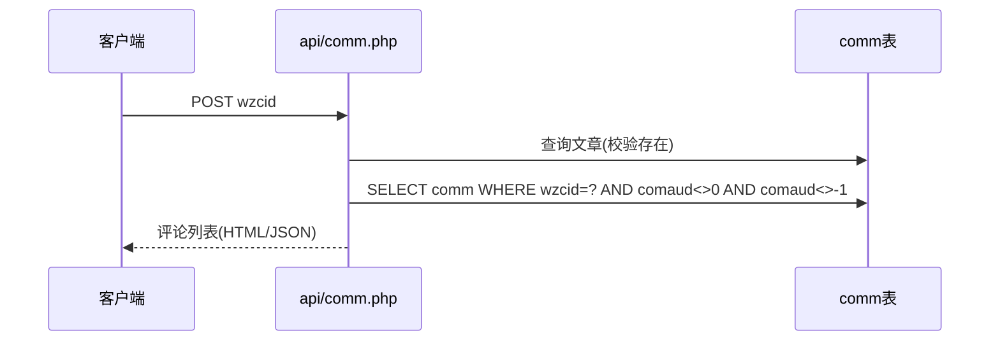

# 评论（comm）

评论是用户对文章发表的留言，支持回复与审核。

## 什么是评论？

评论对应 `comm` 表，承载文章下的用户评论。一条评论可回复另一条评论（通过 `bcouser`/`bconame` 记录被回复者），是否展示由审核状态 `comaud` 决定。ThinkPHP 版还支持匿名评论与评论编辑历史（`comment_edit_history` 表）。

**关键特征**:
- 与文章通过 `wzcid`（文章 cid）关联
- 有独立评论 cid（`ecid`）用于定位/删除
- 审核状态在加载查询中过滤（`comaud<>0` 且 `<>-1`）

## 代码位置

| 方面 | 位置 |
|------|------|
| 模型 | `sanqi-thinkphp/app/model/Comm.php` |
| 控制器 | `sanqi-thinkphp/app/controller/api/Comment.php`、`admin/Auditco.php` |
| 原生接口 | `sanqi/api/comm.php`（加载）、`fbpl.php`（发表）、`delcomm.php`（删除） |
| 数据库 | `comm` 表 |

## 关键字段

| 字段 | 类型 | 描述 |
|------|------|------|
| `id` | int unsigned | 自增主键 |
| `wzcid` | varchar(64) | 所属文章 cid |
| `ecid` | varchar(64) | 评论自身 cid |
| `couser` | varchar(64) | 评论者账号 |
| `coname` / `coimg` / `courl` | - | 评论者昵称/头像/网址 |
| `coemail` | varchar(255) | 评论者邮箱（用于游客展示头像） |
| `cotext` | text | 评论内容 |
| `bcouser` / `bconame` | varchar | 被回复者账号/昵称（无则 `false`） |
| `comaud` | tinyint | 审核状态（0 未审核 / 1 已审核 / -1 屏蔽） |
| `cotime` | datetime | 评论时间 |
| `ip` | varchar(45) | 评论 IP |
| `delete_time` | datetime | 软删除时间（ThinkPHP 版） |

## 评论加载流程

## 不变量

1. **审核可见性**: 前端只看 `comaud<>0` 且 `comaud<>-1` 的评论（`sanqi/api/comm.php`）。
2. **发表需登录与文章存在**: `fbpl.php` 校验登录态、邮箱格式、文章 id 存在后才写入。
3. **游客展示**: 游客评论可记录邮箱，ThinkPHP 版通过离散哈希映射游客头像（`getVisitorAvatarByEmail`）。

## 后台审核

`admin/auditco.php`（原生版 `admin/api/escoaud.php`）对未审核评论进行通过/驳回/批量操作，并支持将恶意账号加入黑名单（ThinkPHP 版 `auditco/blacklist`）。