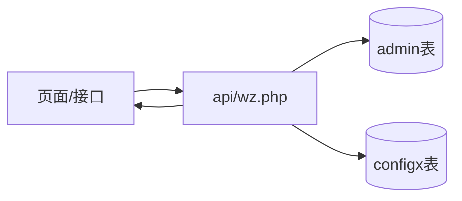

# 配置（configx / admin）

sanqi 的站点全局配置分别存储在 `configx` 键值表和 `admin` 站点信息表中，两版共用相同语义。

## 什么是配置？

配置是站点的可调参数总集，覆盖站点名、副标题、图标、SEO、访问控制、注册/发布开关、审核策略、SMTP 邮件配置、音乐、友链、云存储等。

**两种存储契约**:

| 存储 | 结构 | 说明 |
|------|------|------|
| `configx` | `title`(配置名) + `text`(JSON 内容)，同表复用 | 单一键值扩展点，原文 `sanqi/api/form.php` 读取 `filtertext` 过滤词，ThinkPHP 版逐步迁移到该表 |
| `admin` | 站点元信息表，一列一配置项 | 原生版主配置：`name/subtitle/icon/zt/username/music/regqx/kqsy/ptpaud/emydz/...`，由 `sanqi/install/install.php` 与 `admin/basic.php` 维护 |

## 代码位置

| 方面 | 位置 |
|------|------|
| 模型 | `sanqi-thinkphp/app/model/Configx.php` |
| 服务 | `sanqi-thinkphp/app/service/SiteConfigService.php`（缓存读取） |
| 原生配置加载 | `sanqi/api/wz.php`（每页加载 `admin` 表） |
| 数据库 | `admin` 表、`configx` 表（均可通过后台「基础设置/内容管理」写入） |
| 管理界面 | `sanqi/admin/basic.php`、`sanqi/admin/authver.php`、`sanqi-thinkphp/app/controller/admin/Basic.php` |

## 关键字段（admin 表片段）

| 字段 | 描述 |
|------|------|
| `name` / `subtitle` | 站点名 / 站点介绍 |
| `icon` / `logo` | 站点图标 / logo |
| `zt` | 站点启用状态（1 开 0 关） |
| `username` | 管理员账号 |
| `homimg` | 顶部背景图 |
| `sign` | 站点签名 |
| `music` | 背景音乐配置 |
| `essgs` / `commgs` | 文章/评论公告 |
| `regqx` | 注册开关 |
| `kqsy` | 发布权限开关（0 = 开放，1 = 仅管理员） |
| `ptpaud` | 文章审核要求 |
| `emydz`/`emssl`/`emduk`/`emkey`/`emzh`/`emfs` | SMTP 邮件配置（地址/SSL/端口/密钥/账号/收发方式） |
| `topes` | 置顶文章 id 列表（换行分隔） |

## 配置加载时序

- 原生版每个页面开头 `require config.php` + `api/wz.php`，从 `admin` 表把配置读成全局变量。
- ThinkPHP 版由 `SiteConfigService` 统一读取并缓存（支持 Redis），页面通过 `SiteConfigTrait` 消费；配置写操作（后台表单）落盘并同步清理缓存。

## 不变量

1. **安装后可改不可删**：配置由后台维护，不提供删除入口。
2. **仅管理员可写**：写接口全部校验管理员会话（`admin/basic.php`、`admin/authver.php`）。
3. **迁移路径**：原生版 `admin` 表字段正逐步迁入统一的 `configx` 表（见 `sanqi-thinkphp/database/migrate_admin_to_configx.php`），新增配置优先使用 `configx`。

## 配置版本回滚（ThinkPHP 版）

后台 `admin/config-versions` 提供配置快照（`snapshot`）与恢复（`restore`），由 `ConfigVersionService` 实现，可在误改后回滚站点配置。